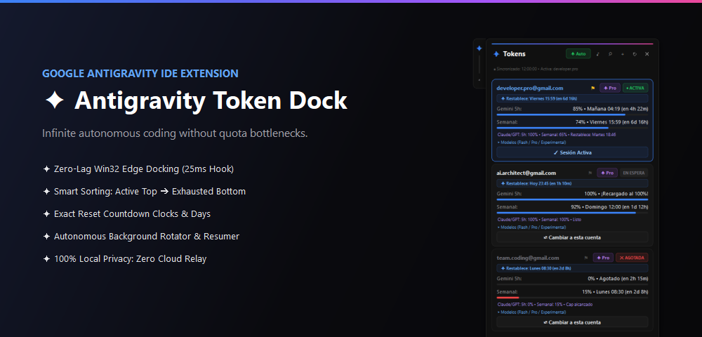
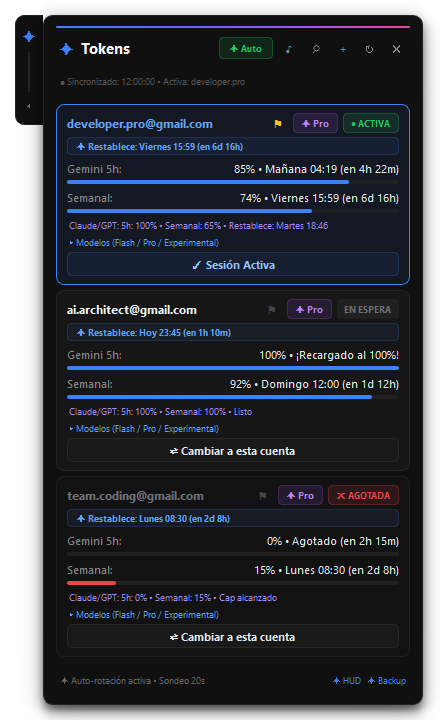
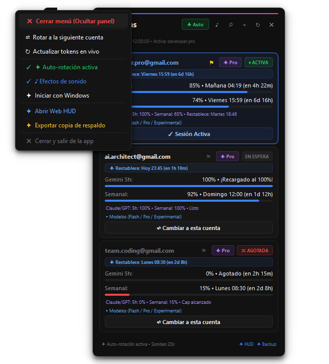
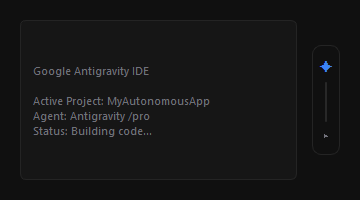

<div align="center">



# ✦ Antigravity Token Dock & Autonomous Account Switcher

**The native docked overlay and continuous quota manager for Google Antigravity IDE.**

[](https://microsoft.com)
[](https://www.python.org/)
[](https://riverbankcomputing.com/software/pyqt/)
[](#-native-antigravity-design-system)
[](LICENSE)
[](https://github.com/BryanGM12/antigravity-token-dock/pulls)

[English](#-overview) • [Español](#-descripción-en-español) • [Quick Start](#-quick-start) • [Visual Showcase](#-visual-showcase) • [Key Features](#-key-capabilities)

</div>

---

## ✦ Overview

When building complex multi-agent architectures or running autonomous tasks in **Google Antigravity IDE**, hitting 5-hour or weekly model quota limits breaks your development flow.

**Antigravity Token Dock** is an ultra-lightweight, hardware-accelerated desktop companion that docks directly to the side of your Antigravity window. It tracks token quotas across multiple accounts in real time, organizes them intelligently, and provides seamless 1-click or fully automated background rotation so you never run out of tokens again.

---

## ✦ Visual Showcase

<div align="center">

| ✦ Expanded Token Hub (Live Quotas & Resets) | ✦ Right-Click Quick Actions Menu |
| :---: | :---: |
|  |  |
| *Live auto-sorted accounts, exact reset days, and progress bars.* | *Right-click anywhere to close panel, toggle auto-rotation, sound, or startup.* |

<br/>

### ✦ Seamless Docked Edge Pill


*Unobtrusive 28px pill docks to the edge of Antigravity IDE. Click to expand; click again or outside to collapse.*

</div>

---

## ✦ Key Capabilities

- **▪ Zero-Lag Win32 Edge Docking**:
  - Hooks directly into Windows native `EVENT_OBJECT_LOCATIONCHANGE` with an adaptive 25ms/80ms heartbeat.
  - Automatically sticks to the right or left edge of Antigravity IDE during window move, resize, minimize, or maximize across multiple monitors.
- **▪ Stutter-Free 60 FPS Fluid Animations**:
  - Hardware-optimized `QVariantAnimation` with `OutCubic` easing.
  - Pre-allocated transparent canvas avoids Windows DWM reallocation hitches for instant, silky-smooth slide transitions.
- **▪ Intelligent Auto-Sorting**:
  - **Active Account (Top)**: Pinned at the very top with glowing active session border and emerald heartbeat indicator (`● ACTIVA`).
  - **Available Accounts (Middle)**: Ready-to-use standby accounts ranked by available quota.
  - **Exhausted Accounts (Bottom)**: Automatically moved to the bottom with live recharge countdowns (`✕ AGOTADA`).
- **▪ Exact Reset Day & Countdown Clocks**:
  - Displays the exact day of the week and clock time of quota resets (e.g., `Mañana 04:19 (en 4h 22m)`, `Viernes 15:59 (en 6d 16h)`).
  - Prominent reset banner at the top of each card keeps you informed at a glance (`✦ Restablece:`).
- **▪ Right-Click Context Menu**:
  - Right-click anywhere on the pill or dock to instantly open quick actions:
    - `✕ Cerrar menú (Ocultar panel)`
    - `⇄ Rotar a la siguiente cuenta`
    - `↻ Actualizar tokens en vivo`
    - `✓ ✦ Auto-rotación activa`
    - `✓ ♪ Efectos de sonido`
    - `✦ Iniciar con Windows`
    - `✦ Abrir Web HUD`
    - `✦ Exportar copia de respaldo`
    - `✕ Cerrar y salir de la app`
- **▪ Account Pinning**:
  - Click the pin icon (`⚑`) on any account to freeze auto-rotation on that specific account when needed.
- **▪ Authentic Deep Obsidian Aesthetic**:
  - Pixel-sampled directly from Google Antigravity IDE: `#101010` container, `#161616` cards, `#242424` hairline borders, and Google AI spectrum gradient (`#3b82f6` ➔ `#6366f1` ➔ `#a855f7` ➔ `#ec4899`).
- **▪ Autonomous Background Daemon**:
  - Background daemon monitors quota exhaustion.
  - Automatically switches accounts and injects a resumption prompt into the active chat so long-running tasks continue seamlessly.
- **▪ 100% Local Privacy & Security**:
  - Zero cloud telemetry or external relays. All configuration stays strictly on your local computer (`accounts_config.json` is git-ignored).

---

## ✦ Descripción en Español

**Antigravity Token Dock** es un widget de escritorio nativo para Windows diseñado para eliminar los límites de cuota de tokens en **Google Antigravity IDE**.

- Se acopla magnéticamente al borde de la ventana de Antigravity sin latencia (Win32 Hook).
- Ordena automáticamente tus cuentas: la cuenta activa siempre arriba, y las que se quedan sin cuota se mueven al fondo.
- Muestra el día exacto de restablecimiento (`Mañana 04:19`, `Viernes 15:59`, etc.).
- Permite rotar cuentas con 1 clic o de forma 100% automática en segundo plano.
- Menú contextual con clic derecho para cerrar el panel, alternar auto-rotación, sonido o inicio con Windows.
- Interfaz moderna obsidian idéntica a Antigravity IDE con animaciones fluidas a 60 FPS.

---

## ✦ Architecture

```text
┌──────────────────────────────────────────────────────────┐
│                   Google Antigravity IDE                 │
│      (Electron / React Fiber / CDP on Port 59123)        │
└──────────────────────────┬───────────────────────────────┘
                           │
             Win32 Events  │  Live Quota Scrapes
         (Location Change) │  (authService / state)
                           ▼
┌──────────────────────────────────────────────────────────┐
│              ✦ Antigravity Token Dock Widget             │
│       - 28px Slim Edge Pill Handle                       │
│       - 410px Minimalist Flyout Panel                    │
│       - Dynamic Sorting (Active Top ➔ Exhausted Bottom)  │
│       - Exact Reset Day Banner & Countdown Clocks        │
│       - Right-Click Context Menu Actions                 │
└──────────────────────────┬───────────────────────────────┘
                           │
             1-Click Switch│ Auto-Rotation Trigger
                           ▼
┌──────────────────────────────────────────────────────────┐
│             Autonomous Background Daemon & Rotator       │
│       - Quota Detector (CDP Inspector)                   │
│       - External Browser OAuth Handler (Vision + Win32)  │
│       - Task Resumer (Restores Active Conversation)      │
│       - SQLite / JSON Persistent State Memory            │
└──────────────────────────────────────────────────────────┘
```

---

## ✦ Quick Start

### 1. Prerequisites
- Windows 10 or Windows 11 (64-bit)
- Python 3.10+
- Google Antigravity IDE

### 2. Clone & Install
```bash
git clone https://github.com/BryanGM12/antigravity-token-dock.git
cd antigravity-token-dock
pip install -r requirements.txt
playwright install chromium
```

### 3. Configure Your Accounts

Copy the configuration template:
```bash
cp accounts_config.example.json accounts_config.json
```

Edit `accounts_config.json` with your Google accounts:
```json
{
  "accounts": [
    {
      "email": "primary.developer@gmail.com",
      "name": "Cuenta Principal",
      "tier": "✦ Pro",
      "tab_index": 1,
      "row_offset": 0
    },
    {
      "email": "secondary.backup@gmail.com",
      "name": "Cuenta Respaldo",
      "tier": "✦ Pro",
      "tab_index": 2,
      "row_offset": 61
    }
  ],
  "monitoring": {
    "poll_interval_sec": 20,
    "hud_port": 59123
  }
}
```

> [!NOTE]
> `accounts_config.json` is protected by `.gitignore` so your private email addresses and tokens are never committed or pushed to GitHub.

---

## ✦ Adding Accounts

You can add accounts through any of these 4 methods:

### Method 1: Directly in the Dock GUI
Click the **`+`** icon in the header bar of the expanded dock. A sleek dialog will appear to input email and Pro tier.

### Method 2: One-Line PowerShell Command
```powershell
.\antigravity-monitor.ps1 add new.developer@gmail.com "Cuenta 3" "✦ Pro"
```

### Method 3: Interactive CLI Wizard
```powershell
.\antigravity-monitor.ps1 add
# or
python config_manager.py --interactive
```

### Method 4: List / Remove Accounts
```powershell
.\antigravity-monitor.ps1 list
.\antigravity-monitor.ps1 remove old.developer@gmail.com
```

---

## ✦ Controls & Hotkeys

| Action | Shortcut / Trigger |
| :--- | :--- |
| **Toggle Expand / Collapse** | Click the edge pill tab `✦` |
| **Close Menu / Hide Panel** | Click anywhere outside OR right-click ➔ `✕ Cerrar menú` |
| **Quick Actions Menu** | Right-click on pill button or panel |
| **Pin Account** | Click the `⚑` icon on any card |
| **Manual Rotate** | Click `⇄ Cambiar a esta cuenta` on any card |
| **Live Refresh** | Click `↻` or right-click ➔ `↻ Actualizar tokens en vivo` |

---

## ✦ Service Management

Use the PowerShell supervisor to manage the background services:

```powershell
# Check live status across all accounts
.\antigravity-monitor.ps1 status

# Start daemon and docked widget
.\antigravity-monitor.ps1 start

# Restart all services
.\antigravity-monitor.ps1 restart

# Stop all background services
.\antigravity-monitor.ps1 stop
```

---

## ✦ Contributing

Contributions are welcome! If you have ideas for new features, bug fixes, or visual improvements:

1. Fork the Project
2. Create your Feature Branch (`git checkout -b feature/AmazingFeature`)
3. Commit your Changes (`git commit -m 'Add some AmazingFeature'`)
4. Push to the Branch (`git push origin feature/AmazingFeature`)
5. Open a Pull Request

---

## ✦ Support the Project

If Antigravity Token Dock saves you time and keeps your coding workflow uninterrupted, please consider starring the repository on GitHub!

---

## ✦ License

Distributed under the MIT License. See [LICENSE](LICENSE) for details.
